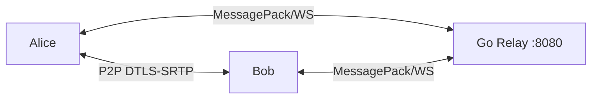

# Silence — End-to-End Encrypted Voice Calling

Two people, same app, encrypted calls. No phone numbers. No accounts required (optional). No SIP provider. No monthly fees.

Audio travels peer-to-peer with DTLS-SRTP encryption. A tiny Go relay handles call setup but never touches audio. Identity is cryptographic (X25519 keypairs), exchanged via QR code.



## Architecture

Three independent credential layers:

| Layer | Key | Lifetime | Purpose |
|-------|-----|----------|---------|
| Identity | X25519 keypair | Forever | Trust anchor. QR exchange. |
| Session | DTLS certificate | Per call | Authenticates WebRTC handshake. Fingerprint compared to identity. |
| Media | SRTP session key | Per call | Encrypts audio. Derived from ECDHE. Relay never sees it. |

The relay is a matchmaker — it stores `fingerprint → WebSocket connection`, creates rooms for calls, and forwards SDP/ICE until peers connect. After that, audio is P2P. The relay knows *that* Alice called Bob, but cannot decrypt *what* they said.

## Tech Stack

| Platform | Language | Framework | Key Libraries |
|----------|----------|-----------|---------------|
| Android | Kotlin | Compose + Hilt | WebRTC (Stream), Tink, ZXing, OkHttp, MessagePack |
| iOS | Swift | SwiftUI + SPM | WebRTC (stasel), Tink, MessagePack.swift, CryptoKit |
| Relay | Go | stdlib | gorilla/websocket, msgpack, bcrypt, uuid |

## Quick Start

### 1. Run the relay

```bash
cd server
PORT=8080 ./silence-signaling
# Optional push notifications:
# FCM_SERVER_KEY="..." APNS_KEY_ID="..." APNS_TEAM_ID="..." APNS_KEY_PATH="..." APNS_TOPIC="..." ./silence-signaling
```

### 2. Install the Android app

```bash
adb install app/build/outputs/apk/debug/app-debug.apk
# Grant permissions:
adb shell pm grant com.silence.app android.permission.RECORD_AUDIO
adb shell pm grant com.silence.app android.permission.CAMERA
```

### 3. Configure on device

1. Open Silence
2. Register account or skip (QR-only mode)
3. Enter relay URL: `ws://<relay-ip>:8080/ws`
4. Tap Continue

### 4. Exchange contacts

1. Both users open the Identity screen (QR code)
2. Scan each other's QR codes
3. Name the contact

### 5. Call

1. Tap contact → Call screen appears
2. Callee taps Accept
3. Both compare the fingerprint on screen
4. Match → green lock: "Verified end-to-end encrypted"
5. Talk

## iOS Build

Open `SilenceApp/Package.swift` in Xcode 15+ and build for iOS 16+. Requires SPM package resolution for WebRTC, MessagePack, and Tink.

## Signaling Protocol

All messages are MessagePack-encoded binary frames over WebSocket.

| Client → Server | Server → Client |
|----------------|-----------------|
| `register` | `registered` |
| `register_user` | `logged_in` |
| `login` | `created` |
| `call` / `call_user` | `incoming` |
| `accept` | `joined` |
| `offer` / `answer` | `offer` / `answer` |
| `ice` | `ice` |
| `hangup` | `hangup` |
| `search_user` | `search_results` |
| | `error` |

## Security

- **Identity**: X25519 keypairs via Google Tink. SHA-256 fingerprint (first 8 bytes) for human comparison. QR exchange prevents MITM at setup.
- **Media**: DTLS-SRTP via WebRTC. ECDHE key exchange per call (forward secrecy). AES-128-GCM authenticated encryption.
- **Auth**: bcrypt with cost factor 10 for account passwords.
- **Push**: FCM data messages (Android) + APNs alerts (iOS). Server holds push keys; app never sees them.

**Zero broken primitives**: No RSA, no MD5/SHA-1, no ECB mode, no JWT/OAuth. Cross-referenced against 4 security skill files.

## Endpoints

| Path | Method | Response |
|------|--------|----------|
| `/health` | GET | `{"status":"ok","clients":N}` |
| `/api/users` | GET | `{"users":[...],"count":N}` |
| `/api/users` | POST | Register or login (JSON body) |
| `/ws` | Upgrade | WebSocket signaling (MessagePack binary) |

## Environment Variables

| Variable | Required | Purpose |
|----------|----------|---------|
| `PORT` | No | Listen port (default 8080) |
| `FCM_SERVER_KEY` | No | Firebase Cloud Messaging (Android push) |
| `APNS_KEY_ID` | No | Apple Push Notification key ID |
| `APNS_TEAM_ID` | No | Apple Developer team ID |
| `APNS_KEY_PATH` | No | Path to .p8 private key file |
| `APNS_TOPIC` | No | iOS bundle ID |

## Development

```bash
# Test the relay (no device needed):
./test-e2e.sh

# Build Android APK:
./gradlew assembleDebug

# Syntax-check iOS:
swiftc -parse SilenceApp/Sources/**/*.swift
```

## License

MIT
